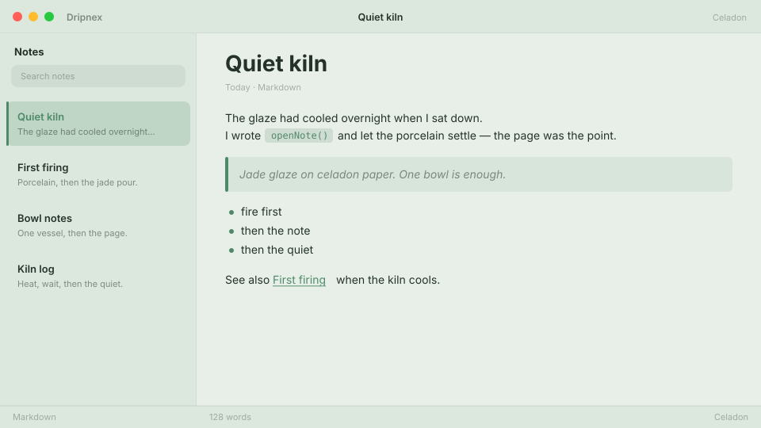

# Celadon

Celadon porcelain. Jade glaze, quiet kiln.



```
dripnex/theme-celadon
```

## Palette

The chips live in [palette.html](palette.html) — open it in a browser. GitHub won’t paint HTML swatches here, so the hex list is below.

| Name | Token | Color | What it’s for |
| --- | --- | --- | --- |
| Base | `--bg-base` | `#e7efe8` | Window background |
| Surface | `--bg-surface` | `#dce8de` | Sidebar and chrome |
| Elevated | `--bg-elevated` | `#f3f7f3` | Raised panels |
| Text | `--text-primary` | `#24322a` | Headings and body |
| Muted | `--text-muted` | `#24322a · rgba(36, 50, 42, 0.52)` | Secondary copy |
| Accent | `--accent` | `#4e8a68` | Selection and links |
| Active | `--status-active` | `#4e8a68` | Active status |
| Dropped | `--status-dropped` | `#c45a5a` | Dropped status |

Pick it for a quiet kiln: porcelain paper, jade glaze, not tea and not forest.
